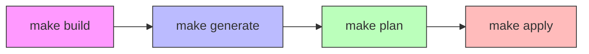

# Docker Quick Start Guide

A simple guide to get started with the Squadcast Migrator using Docker.

## Quick Start

1. **Set up environment**

   ```bash
   # Copy the template
   cp .env.template .env
   
   # Edit .env with your API keys
   # Required variables:
   # - SOURCE=opsgenie (or pagerduty)
   # - OPSGENIE_API_KEY or PAGERDUTY_API_TOKEN
   # - SQUADCAST_REFRESH_TOKEN
   ```

2. **Build the container**

   ```bash
   make build
   ```

   This builds the Docker container with all required dependencies.

## Core Commands

The migrator uses these essential commands in sequence:



### Command Details

- `make generate`
  - Fetches data from your source system (OpsGenie/PagerDuty)
  - Creates Terraform configurations for Squadcast resources
  - Output is saved to your configured `TERRAFORM_OUTPUT_PATH`

- `make plan`
  - Shows what resources will be created in Squadcast
  - No actual changes are made at this stage
  - Great for reviewing the migration plan

- `make apply`
  - Creates or updates resources in Squadcast
  - Uses the Terraform configs generated earlier
  - Actually performs the migration

Each command builds on the previous one, so run them in this order:
build → generate → plan → apply
